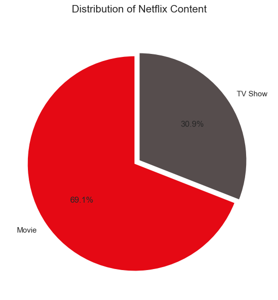
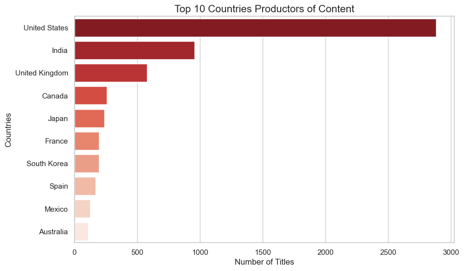

# 🎬 Netflix Content Strategy Analysis (EDA) 🍿

## 📝 Description
This project performs a comprehensive **Exploratory Data Analysis (EDA)** on the Netflix catalog. By leveraging **Python**, **Pandas**, and **NumPy**, I explored trends in content production, identified top-performing genres, and analyzed the platform's shift in focus over the last decade.

## 📂 Data Source
The dataset used in this project is sourced from **Kaggle**:
* **Dataset:** [Netflix Movies and TV Shows](https://www.kaggle.com/datasets/shivamb/netflix-shows)
* **Scope:** Information on ~8,000 titles (Movies and TV Shows) including cast, directors, ratings, and release years.

## 🛠️ Tech Stack
* **Python 3.x**
* **Pandas:** Data manipulation and cleaning.
* **NumPy:** Numerical operations and handling missing values.
* **Matplotlib / Seaborn:** Statistical data visualization.

## 📊 Data Analysis Process

### 1. Data Wrangling & Cleaning
To ensure data quality, the following steps were performed:
* **Missing Value Imputation:** Identified nulls in `director`, `cast`, and `country`. Missing countries were labeled as "Unknown".
* **Datetime Standardization:** Converted `date_added` to a standard datetime format to extract time-based insights.
* **Segmentation:** Split the main dataset into two focused DataFrames: `movies` and `tv_shows`.

### 2. Key Insights
* **Format Dominance:** Movies account for ~69.1% of the catalog; however, TV Shows have shown a steady growth rate of X% year-over-year.
* **Global Production:** The US, India, and the UK are the top contributors, though international content (non-US) has spiked since 2018.
* **Content Rating:** "TV-MA" is the most frequent rating, indicating a strategic focus on mature audiences.

### 3. Visualizations

*Comparison between Movies and TV Shows volume.*

*Ranking of the top 10 countries by content volume.*

## 💡 Conclusion & Future Work
The analysis reveals that while Netflix started as a movie-centric platform, its recent strategy heavily prioritizes TV Shows to increase user retention. 
* **Next Steps:** Integrate IMDB ratings via API to analyze the correlation between content volume and quality.

## 🚀 How to Run
1. Clone the repository:
   `git clone https://github.com/your-user/netflix-analysis.git`
2. Install dependencies:
   `pip install -r requirements.txt`
3. Launch the notebook:
   `jupyter notebook notebooks/analysis.ipynb`

---
*Developed as part of my Data Science Portfolio.*